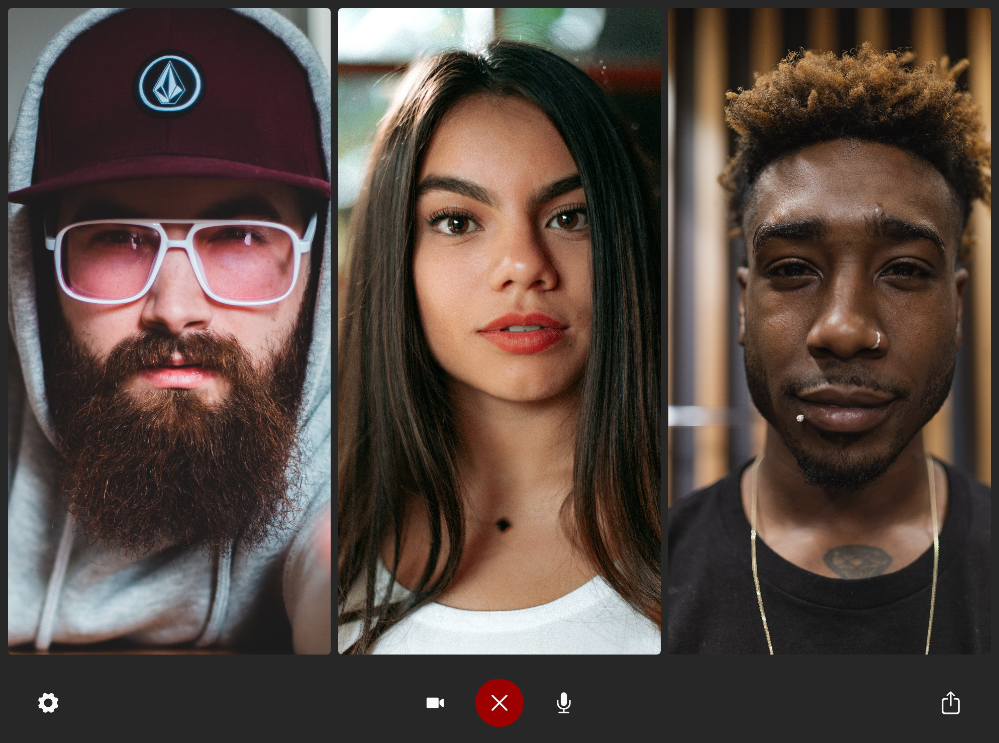

# Brie.fi/ng

> Secure video chat via pure WebRTC



Privacy is the driving force behind this project. It uses secure technologies like [WebRTC](https://webrtc-security.github.io/) to directly connect between participants. The website that provides the web app and mediates the communication stores as few data as possible and does not know anything about the contents of established conversations. No accounts are required. No cookies are used.

The difference between Briefing and most similar projects is, that it does not use a central server that distributes the video streams ([SFU](https://webrtcglossary.com/sfu/)). The advantage of an SFU is that it saves bandwidth due to the fact that the own video does not being uploaded to each participant but only once. The SFU can also do more optimizations the clients might not support. But then the video signal is not end-to-end encrypted anymore, i.e. you have to trust the SFU provider. Briefing instead sends data from peer to peer directly ("Mesh") and therefore the data does not travel over the server under normal operation. The WebRTC peers however still trust the signaling server for the authenticity of the peer-to-peer communications encryption in place.

## Web App / Native Apps

Briefing is a [PWA](https://web.dev/progressive-web-apps/) i.e. it is a web app, that can be installed from inside the browser on some platforms. To put Briefing on your home screen in iOS Safari tap on the "Share" icon and choose "Add to Home Screen". You can do the same in browsers like Google Chrome. **Therefore, native apps are not really required.**

But alongside to these awesome out-of-the-box features, we still have some native support as well:

### Native iOS App

[Briefing is available in the Apple AppStore](https://apps.apple.com/app/briefing-video-chat/id1510803601). You can find sample code in the `ios` folder.

### Native Electron App

[Briefing is available in the Microsoft Store](https://www.microsoft.com/de-de/p/briefings/9pcs356fc2jf). The source is available in the `electron` folder.

### Native Android App

The `android` folder contains a sample. Build your own distribution following [this guide](https://developers.google.com/web/android/trusted-web-activity/quick-start).

## Adopt Briefing for your Project

Briefing needs quite some adoptions and modifications if you want to use it in your project. Please remember, that if you don't plan to publish your changes under EUPL, you'll need to purchase a [commercial license](#commercial-license).

However, you can just use the installation on the website <https://brie.fi/ng> for free, as long as you keep the branding intact

### 1. Link

The simplest way to use Briefing is to distribute links to it. The have the form of `https://brie.fi/ng/<room-name>`, where you need to replace `<room-name>` by some random name you can choose.

### 2. Embedding

You can also embed Briefing in your website using an `iframe`. [Visit this configuration page](https://brie.fi/ng/embed-demo) to find the best setting for you.

### 3. Installation

But in case you want to run it on your own hardware, it is important to understand what parts are required.

**Servers**

1. Frontend: The web app the user interacts with. You find it in the `app` folder. Build it via `npm run build` and put the contents of `dist` on your server. Briefing uses some tricks to have the neat `/ng` path working, and you can learn in the [Wiki how to configure Apache](https://github.com/holtwick/briefing/wiki/Apache-Configuration) to handle the routes correctly. Under [configuration](#configuration), you can learn how to set up your own domain and room path.

2. Signaling Server: You can use mine for the start, which is located at `wss://sig03.brie.fi`. If you want to use your own, you find the source code in the [signal](./signal/)` folder. It is a simple node.js app that just connects peers in one room by helping to establish the WebRTC connection. You can learn from the [Wiki how to do port forwarding in Apache](https://github.com/holtwick/briefing/wiki/Signaling).

3. STUN/TURN Server: You can use mine or any other for the start. STUN is required to get peer to peer connections through firewalls. TURN is used if that does not succeed. The later one can cause some server load. Learn from the [Wiki how to set up such a server](https://github.com/holtwick/briefing/wiki/TURN-&-STUN-Installation).

The [wiki](https://github.com/holtwick/briefing/wiki) has some more resources.

**Configuration**

In the `app` folder you will find a [.env](https://github.com/holtwick/briefing/blob/master/app/.env) file with samples of how to adjust the settings for your needs. For example to modify the share URL and the sub path for your room you might do like this:

```ini
VUE_APP_ROOM_URL = https://example.com/room/
VUE_APP_ROOM_PATH = /room/
```

Make sure to also adopt the `ROOM_PATH` manually in [`service-worker.js`](https://github.com/holtwick/briefing/blob/master/app/src/service-worker.js#L3), which is not automatically updated yet.

Similar settings are available for your own signaling and STUN/TURN servers.

When you build the distribution for your website via `npm run build` these settings will be baked in.

## Licenses

### Public License

Briefing is free and can be modified and forked. But the conditions of the EUPL (European Union Public License 1.2) need to be respected, which are similar to ones of the GPL. In particular modifications need to be free as well and made available to the public. Get a quick overview of the license at [Choose an open source license](https://choosealicense.com/licenses/eupl-1.2/). This license is available in the [languages of the European Community](https://eupl.eu/).

### Commercial License

For commercial use or closed source projects, we can offer licensing under the following terms.

> World-wide, non-exclusive, non-transferable and non-sub-licensable license of Briefing as is on https:// github.com/holtwick/briefing/ for use in purchasers products, as long as the resulting software does not stand in concurrence to Briefing itself. Any liability is excluded. The law of the Federal Republic of Germany shall apply exclusively.

The one time fee is 499 EUR net. Please contact [license@holtwick.de](mailto:license@holtwick.de) or [purchase directly via Paddle](https://buy.paddle.com/product/650756).

## Author

My name is Dirk Holtwick. I'm an independent software developer located in Germany. Learn more about my work at [holtwick.de](https://holtwick.de/about).

## Contribute

Contributions are always welcome. The best way is to start adding or responding to [issues](https://github.com/holtwick/briefing/issues).

For adding or fixing translations get started here: https://github.com/holtwick/briefing/tree/master/app/src/locales
