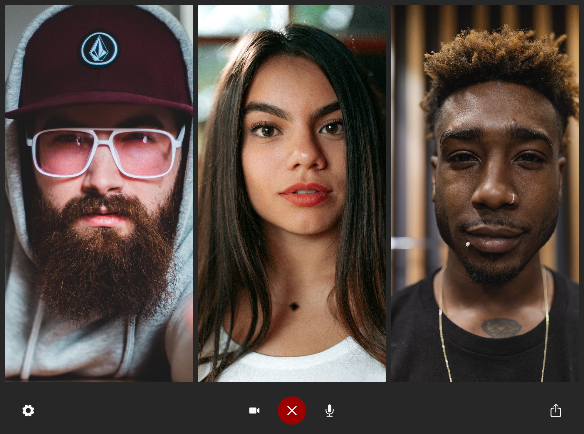
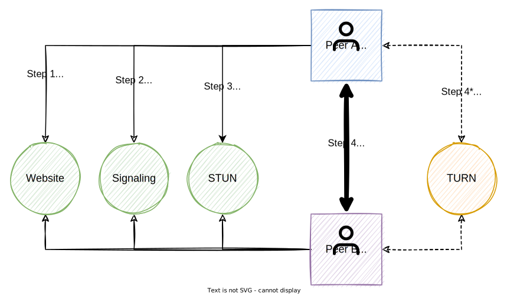

# Brie.fi/ng

**Secure direct video group chat**

> Choose your language: [en](README.md) | [de](README-de.md)

 Privacy is the central idea behind this project. Only open technologies (such as [WebRTC](https://webrtc-security.github.io/)) are used, which work with all modern browsers. Thus, no installation of additional software is required, and the approach remains future-proof.

A conversation can be started immediately for free via [Brie.fi/ng](https://brie.fi/ng). A [free iOS app](https://apps.apple.com/app/briefing-video-chat/id1510803601) is also available.

Features such as desktop sharing, text chat and simple invitation links are available. More can be easily added with knowledge of Javascript and Vue.

## Quick start for developers

Download or clone the project to your local machine, and you are ready to go:

```sh
npm install
npm run start
```

## Batteries included

A WebRTC video chat application requires multiple components to work properly. Briefing includes everything you need to get started: User Interface, Signaling and STUN. 

Learn more about it in the [**→ documentation**](./docs/README.md).



## Customization / Whitelabeling

To use Briefing for your own project, the following options for all levels of experience are available:

1. **create a room** via [Brie.fi/ng](https://brie.fi/ng) and copy the link into your website.
2. **embed** Briefing via 'frame' into your own site. Use the [handy configurator](https://brie.fi/ng/embed-demo).
3. start Briefing on your **own server** e.g. [via Docker](docs/installation/docker.md) or use a service like [fly.io](docs/fly.io.md), [render.com](docs/render.com.md), Google Cloud, AWS, Azure ... you name it.
4. **customize** the source code according to your needs. See the [documentation](docs/README.md) for details.

Learn more at [**→ installation**](./docs/installation/README.md).

## Licenses

In general Briefing is free, however a **[commercial license](#commercial-license) is also available**, which I ask you to purchase, especially for "white labeling" applications. Otherwise, I appreciate support for the project through [sponsorship via GitHub](https://github.com/sponsors/holtwick) to support further development. Thanks.

### Public License

The terms of the AGPL 3.0 or later (GNU Affero General Public License v3.0) apply: "Permissions of this strongest copyleft license are conditioned on making available complete source code of licensed works and modifications, which include larger works using a licensed work, under the same license. Copyright and license notices must be preserved. Contributors provide an express grant of patent rights. When a modified version is used to provide a service over a network, the complete source code of the modified version must be made available." <https://choosealicense.com/licenses/agpl-3.0/>.

### Commercial license

For commercial use or closed source projects / "white labeling" I offer a license with the following conditions:

> Worldwide, non-exclusive, non-transferable, non-sublicensable license of Briefing, as found at https:// github.com/holtwick/briefing/, for use in purchaser's products, as long as the resulting software is not in competition with Briefing itself. Any liability is excluded. The law of the Federal Republic of Germany applies exclusively.

The one-time fee is 499 EUR net. Please contact [license@holtwick.de](mailto:license@holtwick.de) or [buy directly via Paddle](https://buy.paddle.com/product/650756).

## Author

My name is Dirk Holtwick. I am an independent software developer based in Germany. Learn more about my work at [holtwick.de](https://holtwick.de/about).

## Contribute

Contributions are always welcome. The best place to start is to add or respond to [Issues](https://github.com/holtwick/briefing/issues).

To add or correct translations, start here: [→ locales](locales/).

## Major Releases

### Version 3.0

Full migration to Vue3 and Typescript. Localization using vue-i18n standard library. Modernization of many parts of the project. See [→ blog post](docs/blog/version3-en.md) ([de](docs/blog/version3-de.md))

### Version 2.0

Introduced Typescript support. Migration to Vite. Replacing socket.io with reliable [Zerva](https://github.com/holtwick/zerva). Docker images. Reduction to the essential parts of the project. See [→ blog post](docs/blog/version2-en.md) ([de](docs/blog/version2-de.md))

### Version 1.0

Based on Webpack and had examples for iOS, Android, Windows, and Electron, as well as a separate signal server. It also offered background blur and image backgrounds via Unsplash. All of these implementations were deprecated. However, the code is still accessible via the [legacy branch](https://github.com/holtwick/briefing/tree/legacy), but is no longer maintained or supported.

---

This document is also available in [German language](README-de.md).
